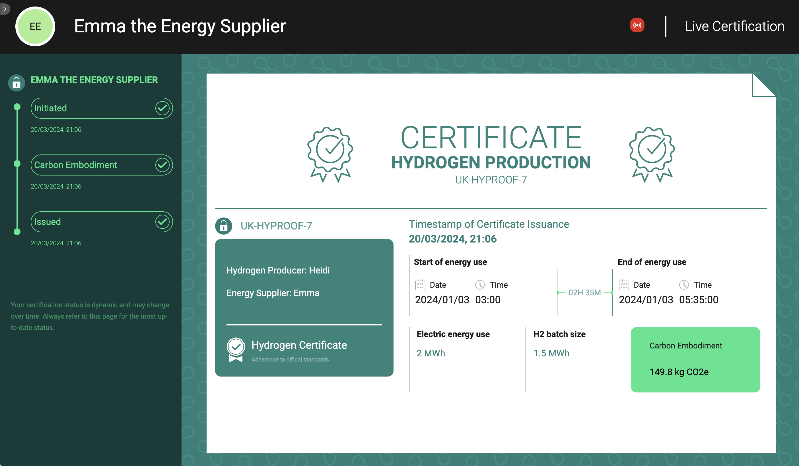

# HyProof Demonstration

This document walks you through the steps required to deliver a complete demonstration of certificate issuance and revocation using the HyProof system

## Basic Demo Prerequisites

You will require `git` and `docker` to be installed on your machine in order to run these locally, and have some familiarity with a command line interface.

In order to be able to reproduce the steps described in this document, you need to have both the back-end API (`sqnc-hyproof-api`) and front-end user interface (`sqnc-hyproof-client`) components running.

The first step is to fetch both of these codebases from Github.

Change into your preferred directory for cloning git repositories and enter the following commands:

```
git clone https://github.com/digicatapult/sqnc-hyproof-api.git
```

followed by

```
git clone https://github.com/digicatapult/sqnc-hyproof-client.git
```

### Installing and running the HyProof back-end API

Use the following command in the `sqnc-hyproof-api` folder to build and run the 3-persona testnet used for the demonstrator:

```sh
docker compose -f docker-compose-3-persona.yml up --build -d
```

Wait for all containers to fully load and come to a steady state before proceeding with the user interface.

### Installing and running the HyProof user interface 

Use the following commands in the `sqnc-hyproof-client` folder to install all necessary packages and initialise the system:
```
npm ci
```
followed by
```
npm run init
```
After completion of the initialisation script, the demonstration will have loaded the identities of all the personas in the demonstration, and 3 sample certificates. It is now ready to be used.

Run the following command to begin the demonstrator:
```
npm run dev
```

## Running the Demo

Load your web browser and navigate to `localhost:3000`. The demonstrator works in most browsers, but is best viewed in Chrome.

This brings up the landing page of the **HyProof Demonstrator** as shown below:


The landing page of the demo shows a list of existing certificates for individual batches of hydrogen. Each one represents a different amount of hydrogen that has been certified, alongside the embodied CO~2~ for each batch, and some other details.

We will now walk through the demonstration following a *happy path* workflow. This takes the following steps:

- Heidi the Hydrogen Producer initialises a certificate
- Emma the Energy Supplier calculates the embodied CO~2~ (eCO~2~)
- Emma the Energy Supplier adds eCO~2~ to the certificate
- The system now issues the final certificate

One further workflow can be demonstrated for Reginald the Regulator:

- Reginald the Regulator reviews and revokes a certificate

### 1. Heidi the Hydrogen Producer initialises a certificate

You will first adopt the persona of Heidi, a Hydrogen Producer. Heidi has just generated a batch of hydrogen through electrolysis and is now seeking to have that batch certified.


In order to obtain a certificate for a new batch of hydrogen, click on the `New Certificate` button in the right hand panel.

This will bring up an input page where Heidi records the start and end time of hydrogen production, the batch size to be certified, and the amount of electricity that was used to generate the hydrogen.


When you've finished entering all of the relevant information, click the `Submit` button in the right hand panel.

The system will now send this data to the shared ledger via the API and display a small wait animation in the button.

`Heidi` also transmits a separate packet of data to her contracted energy provider `Emma the Energy Supplier` to allow `Emma` to complete the certification process.

The panel on the left hand side of the screen will indicate when the certificate has been successfully `Initiated` on the ledger.

It is now time to change persona to `Emma the Energy Supplier`. 

### 2. Emma the Energy Supplier completes the certificate

You should first change persona by pressing the right arrow just below the `Hydrogen Innovation Initiative` logo in the top left hand side of the screen.

>Image showing arrow highlighted

This opens a drawer showing the 4 personas available in the demonstrator. Select `Emma` and the background will turn green indicating a successful switch. Close the drawer by pressing the arrow again.

`Emma`'s work is automatically carried out by the system itself in the background. 


What is happening is as follows:

1. `Emma` previously received a data packet from `Heidi` containing:

    - a `cryptographic commitment` to the content of this data
    - the `start time` and `end time` of `Heidi's` hydrogen production
    - the total `kWh` of electricity used by `Heidi`

2. `Emma` first checks this additional private data aligns with what has been publicly recorded by `Heidi` on the ledger using the `cryptographic commitment`. This keeps `Heidi` honest

3. `Emma` then calculates the embodied CO~2~ for `Heidi`'s batch from:

    - the `time window` sent by `Heidi`
    - the total `kWh` used by `Heidi`
    - `Emma`'s knowledge of her `carbon intensity` over that period

4. `Emma` submits this embodied CO~2~ value to the ledger to be added to the certificate that `Heidi` previously intitiated

5. The system updates the certificate into a final `Issued` state



### 3. Viewing the final certificate

Taking a look at the final certificate, it is clear to see the following valuable information:

- Date and time of certification
- Guarantees of origin (the hydrogen producer and energy supplier)
- Batch size
- Total embodied CO2

The system also protects against certain personas obtaining information that they should not be allowed to see. This can be demonstrated by keeping the current certificate on the screen and switching between personas using the left hand drawer.

`Heidi` and `Emma` see a certificate that has been generated from their local databases where they first entered or calculated the data, and the information recorded on the ledger itself. As a result, both `Heidi` and `Emma` can see all of the data associated with a batch of hydrogen they collaboratively certified.

`Reginald` and `Connor` do not have access to the private data that `Heidi` shared with `Emma`, so they do not have access to:

- `Heidi`'s `time window` of production
- the total `kWh` used by `Heidi`
- `Emma`'s knowledge of her `carbon intensity` over that period

This means that these two personas only see the total batch size and the total carbon embodiment of that batch.


If the `Regulator` wanted to obtain additional information for audit purposes, they could request this directly from `Heidi` or `Emma`.

The truth of this data could then be confirmed against the cryptographic data within the ledger, or transmitted between `Heidi` and `Emma` to generate the certificate. 

In this way `Heidi` and `Emma` keep each other honest, and the `Regulator` keeps them both honest.

### 4. Revoking the certificate

One final action that is possible within the system is the ability for the `Regulator` to revoke a certificate.

However, in order to keep the `Regulator` themselves honest and auditable, the reasons for revocation must be recorded in an indelible, high integrity manner, and made available to others.

In order to demonstrate this functionality, we now switch to the persona of `Reginald the Regulator` using the left hand drawer.

>Reginald's view

`Reginald the Regulator` has identified a problem with this latest hydrogen certificate.

Click on the `Revoke Certificate` button on the right hand side. This will pop up a form that asks you to supply the reasons for revocation.

The system is designed like this to prevent revocation from happening without a reason first being given and linked to the certificate that it is revoking.

>image of revoke wizard tool

`Reginald the Regulator` clicks submit, and the form is loaded into the system and attached to the relevant certificate.

Upon completion the certificate is now `Revoked`. This is instantly visible to all personas.

---

### End of demonstration

